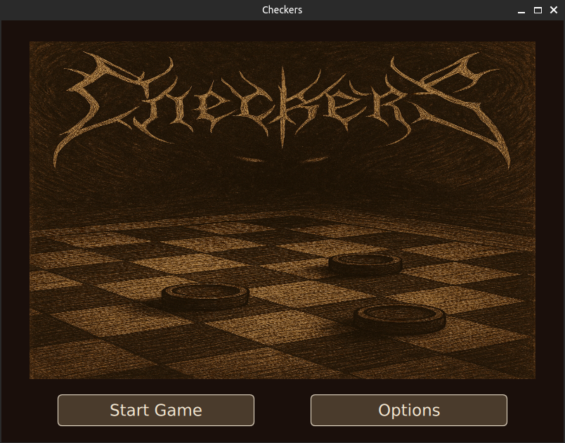
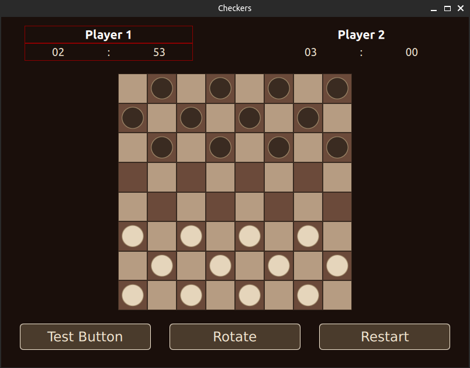

# Checkers (Qt / QML)

A **classic Checkers (Draughts) game** implemented in **C++ (Qt 6) and QML**, featuring drag-and-drop gameplay, basic AI opponent, multiple game modes, and a clear (though still evolving) separation between logic and UI.

This project was created as a **portfolio and educational MVP**.

---

## 🎮 Game Rules

The game follows standard **Checkers (English Draughts)** rules:

- Played on an 8×8 board
- Players alternate turns (White vs Black)
- Pieces move diagonally on playable (dark) squares
- Captures are **mandatory**
- Multiple captures in a single turn are supported
- Promotion to **King** occurs when a piece reaches the opponent’s back row
- The game ends when:
  - one player loses all pieces, or
  - a player has no legal moves remaining

Supported modes:
- Human vs Computer
- Human vs Human (hot-seat)
- *(Online mode is planned but not implemented)*

---

## 📸 Screenshots




---

## 🧱 Architecture Overview

The project uses a **Qt / QML hybrid architecture** with most game logic implemented in C++, and the UI built in QML with supporting JavaScript utilities.

While functional and readable, this project intentionally reflects an **MVP-level architecture** and leaves room for refactoring and further separation.

---

### 1. Application Entry Point (`main.cpp`)
Responsibilities:
- Initializes the Qt application
- Creates and wires together core game components:
  - `CheckersModel`
  - `GameController`
  - `GameLogic`
  - `ComputerPlayer`
  - `GameSettingsManager`
- Registers C++ objects and enums for QML access
- Loads the main QML UI

Acts as the **composition root** of the application.

---

### 2. `CheckersModel` – Board & State Model
**Role:** Central data model representing the board state.

- Inherits from `QStandardItemModel`
- Stores:
  - board fields
  - piece ownership (player)
  - piece type (man / king)
  - move ranges and capture availability
- Exposes rich custom roles to QML (selection, ranges, coordinates, etc.)
- Maintains current player turn

This model is heavily used by both **game logic and UI**, making it the core of the application.

---

### 3. `GameLogic` – Rules Engine
**Role:** Implements core Checkers rules.

- Validates moves and captures
- Enforces mandatory capture rules
- Calculates legal move ranges
- Handles piece removal and multi-capture logic
- Tracks scores for both players

Designed as a **logic-focused helper**, separate from UI concerns.

---

### 4. `GameController` – Gameplay Coordinator
**Role:** Connects UI actions with game logic.

- Exposes game state to QML:
  - active player
  - game status
  - winner
- Validates and executes moves requested by the UI
- Handles:
  - player switching
  - promotions
  - game-over detection
- Acts as the main **command layer** for QML

---

### 5. `ComputerPlayer` – Simple AI
**Role:** Provides a basic computer opponent.

- Plays as Black
- Selects random valid moves or captures
- Uses `GameLogic` to obey capture rules
- Communicates move completion back to QML via signals

This is a **simple, non-heuristic AI**, suitable for MVP gameplay.

---

### 6. `GameSettingsManager` – Game Configuration
**Role:** Manages game options.

- Game mode selection:
  - Human vs Computer
  - Human vs Human
  - (Online – TODO)
- Game time presets (including no limit)
- Exposed to QML via properties and enums

---

### 7. QML & JavaScript Layer
**Role:** Presentation and interaction layer.

- QML:
  - Board rendering
  - Piece visuals
  - Drag-and-drop interaction
- JavaScript (`frontEnd.js`):
  - Coordinate calculations
  - UI-model synchronization
  - Helper utilities for piece positioning

> ⚠️ Some responsibilities (especially coordinate handling) currently live in QML/JS and would ideally be refactored into C++ in a future iteration.

---

## 🔗 High-Level Integration

```
QML / JS
   ↓
GameController
   ↓
GameLogic + CheckersModel
   ↑
ComputerPlayer
```

---

## 🚧 Project Status – MVP

This project is a **Minimum Viable Product (MVP)** created **strictly for educational and portfolio purposes**.

- The game is playable but **not feature-complete**
- Several areas are intentionally left as **TODO**, including:
  - improved AI
  - cleaner separation of UI and logic
  - online multiplayer
  - code refactoring and optimization
- No active development is planned

The goal of this repository is to **demonstrate practical Qt/QML integration, game logic implementation, and real-world UI interaction**, not to deliver a production-ready game.

---

## 🛠️ Tech Stack

- **C++17**
- **Qt 6**
- **Qt Quick / QML**
- **JavaScript (QML helpers)**
- **Model-driven UI (QStandardItemModel)**

---

## ✅ Why This Project?

- Demonstrates non-trivial board game logic
- Shows real drag-and-drop interaction in QML
- Combines C++, QML, and JavaScript in one project
- Honest MVP with clear areas for future improvement


